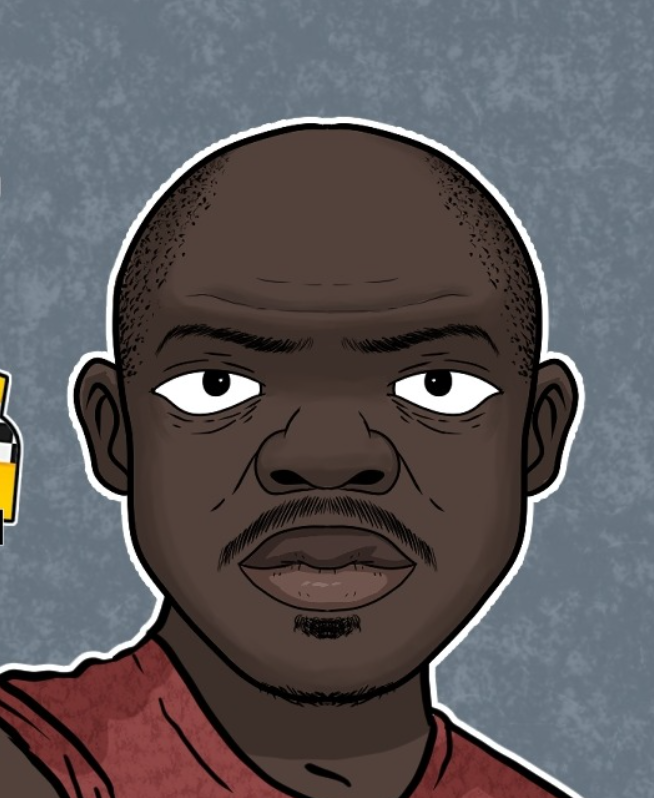

<!-- PROJECT LOGO -->
<br />
<div align="center">
  <a href="https://github.com/nnay29/cassandra-cluster-RAG">
    
  </a>

<h2 align="center">TALLA-RAG</h2>

</div>


<!-- TABLE OF CONTENTS -->
<details>
  <summary>Table of Contents</summary>
  <ol>
    <li>
      <a href="#about-the-project">About The Project</a>
      <ul>
        <li><a href="#built-with">Built With</a></li>
      </ul>
    </li>
    <li><a href="#usage">Usage</a></li>
    <li>
      <a href="#getting-started">Getting Started</a>
      <ul>
        <li><a href="#prerequisites">Prerequisites</a></li>
        <li><a href="#installation">Installation</a></li>
      </ul>
    </li>
    <li><a href="#roadmap">Roadmap</a></li>
    <li><a href="#contributing">Contributing</a></li>
    <li><a href="#license">License</a></li>
    <li><a href="#contact">Contact</a></li>
    <li><a href="#acknowledgments">Acknowledgments</a></li>
  </ol>
</details>


<!-- ABOUT THE PROJECT -->
## About The Project


### Built With

[![Cassandra][Cassandra-badge]][Cassandra-url]
[![Streamlit][Streamlit-badge]][Streamlit-url]
[![Docker][Docker-badge]][Docker-url]
[![Ollama][Ollama-badge]][Ollama-url]

[Ollama-badge]: https://img.shields.io/badge/Ollama-000000?style=for-the-badge&logo=ollama&logoColor=white
[Ollama-url]: https://ollama.com

[Streamlit-badge]: https://img.shields.io/badge/Streamlit-FF4B4B?style=for-the-badge&logo=streamlit&logoColor=white
[Streamlit-url]: https://streamlit.io

[Docker-badge]: https://img.shields.io/badge/Docker-2496ED?style=for-the-badge&logo=docker&logoColor=white
[Docker-url]: https://www.docker.com/

[Cassandra-badge]: https://img.shields.io/badge/Cassandra-1287B1?style=for-the-badge&logo=apache-cassandra&logoColor=white
[Cassandra-url]: https://cassandra.apache.org/


<p align="right">(<a href="#readme-top">back to top</a>)</p>

<!-- USAGE EXAMPLES -->
## Usage

[**TALLA-RAG**](https://github.com/nnay29/cassandra-cluster-RAG) is a local application that lets you chat with your documents using a local LLM backed by a Cassandra cluster for vector storage.

1. Upload a `.txt` or `.pdf` file via the sidebar.
2. Click **Ingest to Cluster** — chunks are embedded and stored across Cassandra nodes.
3. Ask questions in the chat — the app retrieves relevant chunks and answers using the LLM only.
4. Use **Clear All Knowledge** to wipe the vector store.

<!-- GETTING STARTED -->
## Getting Started

### Prerequisites

- [Docker](https://www.docker.com/desktop/) & Docker Compose
- [Ollama](https://ollama.com/download) running locally with the following models pulled:
  ```sh
  ollama pull nomic-embed-text:v1.5
  ollama pull granite3.2:2b
  ollama pull <your_model_name>
  ollama pull <your_embedding_model>
  ```
- [Python 3.11](https://www.python.org) or higher
- [uv](https://docs.astral.sh/uv/) (Python package manager) 
    ```sh
       pip install uv
    ```   

### Installation
1. Clone the repo
   ```sh
   git clone https://github.com/nnay29/cassandra-cluster-RAG.git
   cd cassandra-cluster-RAG
   ```
2. Copy and configure the environment file
    ```sh
    cp .env.example .env
    ```
    Edit .env and set _DOCKER_HOST_IP_ to you machine's local IP adress

3. Start the Cassandra cluster
   ```sh
   docker-compose up -d
   ```

4. Create a virtual environment

    ```sh
    uv venv
    ```
4. Install Python dependencies
   ```sh
   uv sync
   ```
5. Run the Streamlit app
   ```sh
   streamlit run app.py
   ```

   The app will be available at http://localhost:8501


<p align="right">(<a href="#readme-top">back to top</a>)</p>


<!-- ROADMAP -->
## Roadmap

<!-- - [ ] Feature 1
- [ ] Feature 2
- [ ] Feature 3
    - [ ] Nested Feature -->

See the [open issues](https://github.com/nnay29/cassandra-cluster-RAG/issues) for a full list of proposed features (and known issues).

<p align="right">(<a href="#readme-top">back to top</a>)</p>


<!-- CONTACT -->
## Contact

<!-- Your Name - [@twitter_handle](https://twitter.com/twitter_handle) - email@email_client.com -->

Project Link: [https://github.com/nnay29/cassandra-cluster-RAG](https://github.com/nnay29/cassandra-cluster-RAG)

<p align="right">(<a href="#readme-top">back to top</a>)</p>

<!-- ACKNOWLEDGMENTS -->
## Acknowledgments

* []()
* [Working on uv projects](https://docs.astral.sh/uv/guides/projects/)
* [Taximan Talla officiel](https://web.facebook.com/profile.php?id=61555192163930)

<p align="right">(<a href="#readme-top">back to top</a>)</p>

